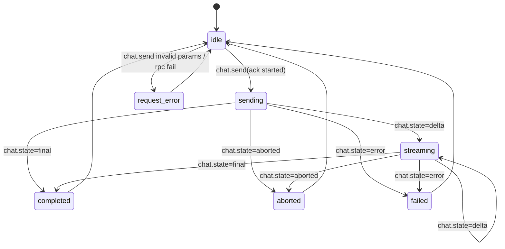

# 深挖报告 0.3：Chat 流式事件链路（delta/final/error/aborted）

创建时间：2026-02-16 13:40:00（UTC）

## 目标
- 在真实运行态验证 Chat 流式状态链路，明确前端状态机应如何驱动。
- 覆盖正常完成、中止、请求异常，以及运行时错误尝试路径。
- 为后续 `1.4/1.5`（Chat 服务层 + SSE）提供可执行的状态策略。

## 测试环境
- 执行环境：`openclaw-gateway` 容器内（Linux）
- 网关地址：`ws://127.0.0.1:18789/ws`
- 客户端身份：`clientName=cli`、`mode=cli`（通过 Gateway 校验）
- 证据脚本：
  - `plan/2026-02-16_ClawX源码调研/evidence/chat-stream-event-probe-live.mjs`
- 原始证据：
  - `plan/2026-02-16_ClawX源码调研/evidence/chat-stream-event-probe-live.json`

## 实测场景与结果

| 场景 | 触发动作 | 终态 | 关键观察 |
|------|---------|------|---------|
| normal | `chat.send` 正常发送 | `final` | 出现稳定 `delta -> final` 链路（本次 15 个 delta） |
| abort | `chat.send` 后调用 `chat.abort` | `aborted` | 终态为 `aborted`，且 `stopReason=rpc` |
| invalidRequest | 故意缺失 `message` 字段调用 `chat.send` | RPC error | 请求直接失败，未产生 run 级流式事件 |
| forcedRuntimeErrorAttempt | `sessions.patch` 设置 `model=__panel_invalid_model__` 后 `chat.send` | `final` | 仍走 `delta -> final`，本次未复现 `chat.state=error` |

补充指标（来自证据 JSON）：
- RPC 调用总数：6
- RPC 失败数：1（`chat.send` 参数校验失败）
- normal run：`seq 2 -> 129`
- abort run：`seq 2`（单个 `aborted` 事件）

## 状态机结论（面板侧建议）

## 关键实现证据（源码对照）
- `chat.send`：先返回 `started`，后异步广播 Chat 事件（`chat.ts`）。
- `chat.abort`：广播 `state=aborted` 且携带 `stopReason`（`chat-abort.ts`）。
- `chat.state=error`：存在代码路径（`broadcastChatError`），但本轮未在实测中触发。
  - 参考文件：
    - `third_party/openclaw/src/gateway/server-methods/chat.ts`
    - `third_party/openclaw/src/gateway/chat-abort.ts`
    - `third_party/openclaw/src/gateway/server-chat.ts`

## 异常策略（用于后续面板实现）
1. 请求级错误（`chat.send` RPC 失败）：
   - 不进入流式态，直接在当前输入回合显示错误提示；
   - 不生成运行中占位消息，避免“假运行”。
2. 运行级中止（`aborted`）：
   - 立即解除输入锁；
   - 对该 run 标记“已中止”，不等待 `final`。
3. 运行级错误（`chat.state=error`）：
   - 视为终态，和 `aborted` 一样释放发送锁；
   - 保留错误文案用于“重试”。
4. 终态收敛：
   - 任意 run 在 `final/error/aborted` 后都应从运行中集合移除，避免脏状态。

## Linux 兼容性结论（本轮）
- 本轮探测直接在 Linux 容器内完成，网关协议和握手路径与生产 Linux 一致。
- 结论可直接作为 Linux 生产部署的状态机输入，不依赖 Windows 宿主差异。
- 仍需在后续 `7.4 Linux 生产回归` 做整页 UI 联动回放（本轮是协议层验证）。

## 结论
- `0.3` 达成：已形成可执行状态机和异常策略。
- 当前可确定的终态链路：
  - 正常：`delta -> final`
  - 中止：`aborted`
  - 请求异常：RPC error（不进入 run 流）
- `chat.state=error` 已确认存在源码路径，但本轮运行态未复现；后续在 `1.5` 联调阶段继续观察并补证据。

